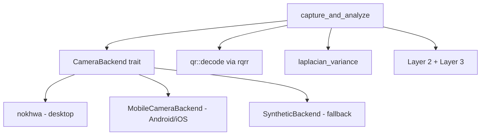
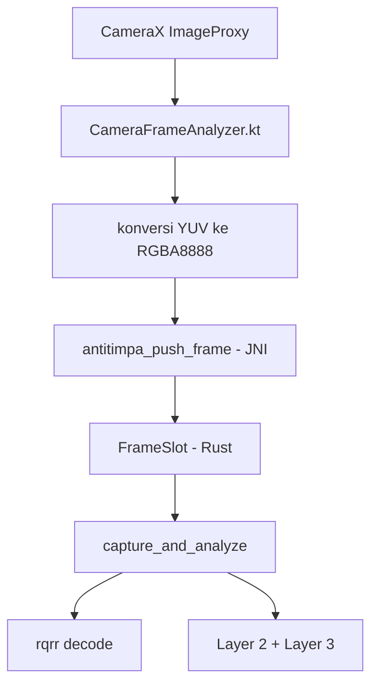

# Anti Timpa QRIS Scanner — catatan pengembangan

> Dokumen ini mencatat **proses migrasi**: prototipe kamera, temuan bug JNI, dan
> catatan lingkungan saat aplikasi Python/KivyMD lama masih ada. Sebagian besar
> isinya menjelaskan **mengapa** arsitekturnya begini, dan bagian
> [Catatan Lingkungan](#catatan-lingkungan) ditulis saat kedua versi masih
> berdampingan — sebutan "folder induk" di sana merujuk pada keadaan saat itu.
>
> Untuk gambaran proyek, cara menjalankan, dan ringkasan migrasi, mulai dari
> **[`README.md`](README.md)**. Untuk langkah build praktis, lihat
> [`BUILD.md`](BUILD.md).

Aplikasi Python/KivyMD yang lama **sudah dihapus** dari repo ini.

Tujuan migrasi: memindahkan **Layer 2 (EMVCo)** dan **Layer 3 (geofence)** ke
Rust, karena kedua layer ini murni pemrosesan string dan tidak butuh kamera
atau OpenCV. Layer 1 (optik) dan kamera menyusul.

## Struktur

```
.
├── index.html
├── package.json
├── vite.config.ts            # dev server dikunci di port 1420 (localhost)
├── tsconfig.json
├── src/                      # React (UI)
│   ├── main.tsx
│   ├── App.tsx               # layar utama + form payload + kamera
│   ├── api.ts                # satu-satunya jembatan ke Rust (invoke)
│   ├── types.ts              # tipe bersama, cerminan struct Rust
│   ├── samples.ts            # fixture demo (dari test_layer2.py)
│   ├── styles.css
│   └── components/
│       ├── RiskGauge.tsx     # gauge skor gabungan
│       ├── CameraPanel.tsx   # kontrol kamera + status backend
│       └── DetailPanel.tsx   # rincian per-layer + payload
└── src-tauri/                # Rust (backend)
    ├── Cargo.toml
    ├── tauri.conf.json       # devUrl = http://localhost:1420
    ├── capabilities/default.json
    └── src/
        ├── main.rs           # wrapper tipis
        ├── lib.rs            # command Tauri + orkestrasi skor + blur
        ├── layer2_emvco.rs   # port layer2_emvco.py
        ├── layer3_geofence.rs# port layer3_geofence.py
        ├── qr.rs             # decode QR (rqrr), ganti cv2 + pyzbar
        └── camera/
            ├── mod.rs        # trait CameraBackend + tipe Frame
            ├── desktop.rs    # nokhwa (V4L2/AVFoundation/MSMF)
            ├── mobile/       # penerima frame dari plugin native
            └── synthetic.rs  # fallback deterministik, bisa diuji
```

## Menjalankan

```bash
npm install

# Hanya UI di browser (backend Rust tidak aktif; ada peringatan di layar)
npm run dev

# Aplikasi penuh: React + Rust core
npm run tauri:dev

# Build produksi
npm run tauri:build
```

Dev server Vite dikunci ke `http://localhost:1420` dengan `strictPort: true`,
dan `tauri.conf.json` menunjuk `devUrl` ke alamat yang sama. Kalau port itu
terpakai, Vite akan gagal keras alih-alih diam-diam pindah port — supaya
WebView tidak pernah menampilkan halaman kosong.

## Konfigurasi localhost / jaringan

- `vite.config.ts` → `server.host` default `127.0.0.1`, port `1420`.
- Untuk uji dari perangkat fisik, set `TAURI_DEV_HOST=<ip-lan>`; Vite akan
  listen di IP itu dan HMR otomatis pindah ke port `1421`.
- `tauri.conf.json` → CSP sudah ketat: `default-src 'self'`, hanya `img-src`
  yang mengizinkan `blob:`/`data:` dan aset lokal. Tidak ada akses jaringan
  keluar, konsisten dengan janji "100% lokal" di README lama.

## Validasi

Test Rust adalah port langsung dari `test_layer2.py`, jadi fixture Python yang
lama tetap berlaku sebagai spesifikasi:

```bash
cd src-tauri

# Logika murni (Layer 2, Layer 3, QR, sintetik, JNI bridge)
cargo test --no-default-features --features jni-bridge --lib

# Termasuk backend kamera desktop
cargo test --features desktop-camera,jni-bridge --lib
```

Hasil saat ini: **57 test lulus**, dan nilainya sudah diverifikasi silang
dengan implementasi Python pada payload yang sama:

| Pemeriksaan | Python | Rust |
|---|---|---|
| CRC payload valid | `1B52` | `1B52` |
| `l2_score` (QRIS bersih) | `0.0` | `0.0` |
| `initiation_mode` | `11` | `11` |
| `mcc` | `5411` | `5411` |
| Geofence Bandung vs JAKARTA | `1.0` / HIGH RISK | `1.0` / HIGH RISK |

> `--no-default-features` mematikan backend kamera desktop saat menguji logika
> murni, sehingga tidak perlu mengompilasi nokhwa/V4L2. Ini bukan sekadar
> penghemat waktu — mesin pengembangan yang dipakai di sini kehabisan ruang
> disk saat link penuh (lihat catatan di bawah).

## Prototipe Kamera

Ini bagian yang menentukan apakah seluruh migrasi layak. Hasilnya: **layak,
tapi ada satu temuan penting.**

### Arsitektur

`CameraBackend` adalah satu-satunya seam antar-platform:



Tiga hal yang berbeda dari aplikasi Kivy lama:

1. **Kamera bukan lagi milik UI.** Di versi lama, video dirender lewat widget
   Kivy, lalu analisis harus membaca balik piksel dari widget itu
   (`analyze_pixels_callback` → `_last_pixels`). Sekarang frame dikirim lewat
   `FrameSlot` biasa, jadi UI boleh render dengan cara apa pun tanpa analisis
   perlu tahu.
2. **Buffer piksel tidak pernah menyeberangi IPC.** `capture_and_analyze`
   mengembalikan metadata saja (lebar, tinggi, blur, skor). Frame 640×480 itu
   ~900 KB sebagai JSON — mengirimnya per frame akan jadi bottleneck serius.
   Analisis seluruhnya berjalan di Rust.
3. **Decode QR cukup satu crate.** Versi lama butuh OpenCV **dan** pyzbar plus
   rantai fallback multi-skala/CLAHE, karena `cv2.QRCodeDetector` sering
   menemukan lokasi QR tapi gagal membaca isinya. `rqrr` menangani skala
   ganda secara bawaan, sehingga seluruh rantai fallback itu hilang.

### Temuan 1: `nokhwa::Camera` tidak `Send`

Ini masalah nyata yang muncul saat kompilasi, bukan asumsi.
`nokhwa::Camera` memiliki `Box<dyn CaptureBackendTrait>` yang trait object-nya
tanpa bound `Send`. Akibatnya `Camera` tidak bisa disimpan di `State` Tauri
(yang mensyaratkan `Send + Sync`).

Tiga pilihan yang dipertimbangkan:

| Opsi | Penilaian |
|---|---|
| `unsafe impl Send` | **Ditolak.** Handle driver-nya memang tidak thread-safe; ini bohong ke compiler |
| Ganti crate | Berlebihan — masalahnya soal kepemilikan, bukan kemampuan |
| **Thread khusus kamera** | **Dipilih.** Satu thread + channel; capture jadi terbukti serial — yang memang dibutuhkan perangkat kamera |

`DesktopCameraBackend::open()` melakukan handshake: thread melaporkan
berhasil/gagal membuka device sebelum `open()` kembali, sehingga kontrak
`Result` tetap terjaga alih-alih gagal belakangan saat capture pertama.

Biayanya satu thread dan satu round-trip channel per capture. Ini temuan yang
layak dicatat untuk porting Layer 1 nanti: ke depan, backend kamera apa pun
harus diasumsikan **tidak** `Send`.

### Temuan 2: `release` yang tidak bisa dibatalkan (bug)

Gejala: kamera yang jelas berfungsi selalu gagal dengan pesan
`Gagal menangkap frame: kamera desktop sudah dilepas`.

Penyebabnya bukan hardware sama sekali. **React StrictMode** di mode
development sengaja melakukan mount → unmount → mount ulang sekali untuk
memunculkan efek yang tidak aman. Cleanup effect saya memanggil
`releaseCamera()` pada unmount-palsu itu:

1. Mount → effect mendaftarkan cleanup
2. StrictMode unmount → cleanup jalan → `release()` → `ready = false`
3. Remount → effect mendaftar lagi, tapi **tidak ada yang membuka ulang kamera**
4. Capture pertama → `ready == false` → error "sudah dilepas"

Bug ini ada di dua tempat, dan keduanya diperbaiki:

**Sisi React** — melepas kamera di cleanup effect adalah kesalahan konsep,
karena cleanup tidak berarti "aplikasi ditutup". Sekarang pelepasan diikat ke
`beforeunload` (sinyal teardown yang sebenarnya) plus guard idempoten.

**Sisi Rust** — `capture()` tidak boleh gagal permanen karena satu
`release()` yang keliru. `ensure_open()` membuka kembali device bila perlu,
jadi backend self-healing.

Ada regression test untuk ini: `capture_succeeds_after_spurious_release` dan
`release_is_idempotent`.

### Temuan 3: `frame()` tidak benar-benar membuka stream

Setelah fix di atas, muncul error kedua — dan log diagnostiknya yang
mengungkap:

```
Camera::new berhasil (index=0); resolusi=1280x720
kamera berhasil dibuka ulang
camera.frame() gagal: Could not capture frame: Stream Not Started
```

Perhatikan: `Camera::new` **berhasil** dan melaporkan resolusi yang benar, tapi
`frame()` tetap gagal. Kamera terdeteksi, tapi stream-nya tidak pernah terbuka.

Dokumentasi `nokhwa` menyebut:

> `open_stream()` — *This will be called internally if you try and call
> `frame()` before you call `open_stream()`.*

Jadi memang ada lazy-open implisit. Masalahnya, pada kamera yang **dibuka
ulang** setelah `stop_stream()`, lazy-open itu tidak memulihkan state device.
Ini jebakan yang mudah terlewat karena jalur pertama (buka sekali) tampak
berfungsi — bug-nya baru muncul di jalur reopen.

Perbaikannya: panggil `open_stream()` **eksplisit** dan verifikasi lewat
`is_stream_open()`, bukan bergantung pada lazy-open. Ini juga membuat
kegagalan muncul saat setup, di mana masih bisa dilaporkan sebagai error
pembukaan yang jelas, bukan error capture yang membingungkan.

Tambahan di `capture_once`: bila stream ternyata tertutup (proses lain merebut
device, atau driver hiccup), stream dibuka ulang alih-alih langsung gagal.

### Pelajaran: `release` bukan "tutup", tapi "kembalikan ke state bisa dibuka"

Kedua bug ini berasal dari akar yang sama: memperlakukan `release` sebagai
operasi final. Backend kamera harus menganggap `release` sebagai reversibel —
baik di level handle (`ensure_open`) maupun di level device (`open_stream`).
### Diagnostik

Kegagalan kamera adalah jenis bug yang paling sulit dilacak: bergantung pada
hardware, driver kernel, jenis sesi desktop, dan proses lain yang kebetulan
memegang device. Pesan "capture failed" tunggal tidak berguna di situasi itu.

Dua bug di atas ditemukan justru karena log-nya ada: baris
`Camera::new berhasil` yang diikuti `Stream Not Started` langsung menunjukkan
bahwa masalahnya ada di antara pembukaan device dan pengambilan frame.

Karena itu setiap tahap yang bisa gagal mencatat apa yang dicoba dan apa
hasilnya, dengan tag yang sama seperti aplikasi Kivy lama:

```bash
npm run tauri:dev          # log muncul di terminal
adb logcat -s ANTITIMPA    # di Android
```

Untuk tracing per-frame (sangat berisik, hanya saat dibutuhkan):

```bash
ANTITIMPA_CAM_DEBUG=1 npm run tauri:dev
```

Yang bisa dibedakan dari log:

| Pesan | Artinya |
|---|---|
| `Camera::new gagal (index=0)` | Device tidak ada / izin ditolak / dipakai proses lain |
| `camera.frame() gagal` | Device terputus atau timeout driver |
| `decode_image::<RgbFormat> gagal` | Format driver tidak bisa dikonversi |
| `kamera index=0 dalam keadaan released; mencoba membuka ulang` | Self-healing bekerja |
| `native belum pernah mengirim frame sama sekali` | Jembatan mobile belum terpasang |

UI juga menampilkan ini: jumlah frame berhasil/gagal dan pesan error terakhir
muncul di panel kamera, jadi kamu tidak perlu membaca terminal untuk tahu apa
yang salah.

### Jembatan Kamera Mobile (Android)

`MobileCameraBackend` adalah *penerima*: frame tidak datang dari driver yang
di-poll, melainkan didorong oleh sisi native ke `FrameSlot`.



Kode Kotlin ada di `android/` (lihat `android/README.md` untuk cara memasang).
Tiga keputusan yang perlu dicatat:

1. **Konversi YUV→RGBA dilakukan di Kotlin.** CameraX memberi `YUV_420_888`
   secara default. Kotlin memakai intrinsik konversi warna JVM; menulisnya
   manual di Rust berarti mengimplementasikan ulang konversi warna dan mudah
   salah.
2. **Buffer wajib direct.** CameraX `ImageProxy` sudah memberi direct buffer,
   jadi tidak ada memcpy tambahan lewat heap JVM.
3. **Buffer disalin secara sinkron.** Sisi JVM boleh memakai ulang buffer
   segera setelah panggilan JNI kembali; menyimpan pointer-nya akan jadi
   use-after-free. Ada test untuk ini (`copied_buffer_survives_original_drop`).

Sisi Rust-nya sudah tervalidasi: 19 test di `camera/mobile/android.rs` berjalan
di host Linux lewat fitur `jni-bridge`, mencakup penolakan pointer null, buffer
bersalah-ukuran (kasus paling mungkin: mengirim YUV, bukan RGBA), dimensi nol,
pemetaan rotasi 90/180/270, dan kepemilikan buffer.

Fitur `jni-bridge` ada justru untuk ini: kode JNI murni `extern "C"` tanpa
dependensi khusus Android, jadi mengujinya di Linux bermakna — dan itu
satu-satunya cara memvalidasinya tanpa toolchain Android di CI.

> **Belum diverifikasi:** kode Kotlin belum pernah dikompilasi atau dijalankan
> di perangkat. Itu butuh toolchain Android dan build penuh.

## Pratinjau Kamera Langsung

Pratinjau ditambahkan, tapi ada satu kendala keras yang menentukan desainnya:
**transport-nya adalah IPC, dan frame mentah terlalu besar untuk itu.**

Frame 640×480 RGB itu ~900 KB. Sebagai array angka di JSON jadi ~3–4 MB teks,
**per frame**. Di 10 fps itu puluhan MB per detik lewat `invoke` — akan membebani
satu core CPU dan membuat UI tersendat.

Jadi setiap frame pratinjau:

1. **Diperkecil** ke lebar 480 px.
2. **Di-encode JPEG** kualitas 70.
3. **Di-encode base64** jadi `data:` URL untuk ``.

Hasilnya ~40–80 KB per frame — sekitar **50× lebih kecil**. Test
`large_frame_is_downscaled_and_small` memastikan payload tetap di bawah 60 KB.

### Yang penting: pratinjau tidak dipakai untuk analisis

Pratinjau tidak pernah dipakai untuk analisis. Analisis selalu berjalan di Rust
pada frame resolusi penuh. Mengirim JPEG yang sudah diperkecil ke UI lalu
menganalisisnya di sana akan merusak Layer 1 optik, yang justru bergantung pada
detail tepi halus di quiet zone.

### Tidak ada `<video>`, dan itu disengaja

Tidak ada elemen `<video>` maupun MediaStream. MediaStream memang lebih halus,
tapi itu berarti kamera harus dimiliki oleh webview — persis kopling yang
sedang kita lepaskan. Di sini kamera tetap milik Rust dan UI hanya menerima
piksel.

Dua aturan yang menjaga pratinjau tidak berperilaku buruk:

1. **Tidak ada permintaan yang tumpang tindih.** Frame berikutnya baru diminta
   setelah yang sebelumnya selesai. Tanpa ini, satu frame lambat akan membuat
   antrean `invoke` menumpuk tanpa batas dan menghambat capture analisis.
2. **Tidak ada update setelah unmount.** StrictMode unmount sekali di mode
   development; loop yang terus jalan akan menahan kamera dan bocor.

### Kamera hanya melayani satu konsumen

Pratinjau dan analisis memakai **satu device yang sama**, dan driver
mengembalikan *"already taken"* alih-alih mengantre. Jadi pratinjau tick yang
jatuh di tengah capture pengguna akan membuat scan gagal secara acak — jenis
bug terburuk untuk didiagnosis.

Dijaga di dua lapis:

- **UI** menjeda pratinjau saat capture berjalan.
- **Rust** memakai flag `analysis_in_flight`; kalau ada, `camera_preview`
  mengembalikan error "pratinjau dijeda". Ini penting karena kalau hanya UI
yang menjaga, kebenarannya bergantung pada komponen mengingat hal itu.

Flag-nya dikelola `AnalysisGuard`, sebuah scope guard yang membersihkan diri
saat drop. `capture_and_analyze` punya beberapa jalur early-return (lock
poisoned, capture gagal, decode gagal), dan lupa satu saja akan membuat
pratinjau berhenti permanen — bug yang tampak seperti "pratinjau diam-diam
mati". Ada test untuk kedua jalur: `analysis_guard_clears_flag_on_drop` dan
`analysis_guard_clears_flag_on_early_return`.

### Temuan 4: kamera tidak selalu di `/dev/video0`

Gejala: pratinjau hanya menampilkan kotak placeholder, seolah kamera tidak ada.

Log-nya menunjukkan:

```
Camera::new gagal (index=0): V4L2 Error: No such file or directory
beralih ke backend sintetik
```

Kamera laptopnya **ada dan berfungsi**, tapi berada di `/dev/video1`, bukan
`/dev/video0`. Kode saya hardcode index `0`, jadi selalu gagal dan jatuh ke
backend sintetik — yang lalu tampil sebagai "placeholder" di UI karena frame
sintetik memang bukan gambar kamera.

Di mesin ini, `cargo run --example list_cameras --features desktop-camera`
memperlihatkan:

```text
index=2  → Camera::new GAGAL   (node metadata UVC)
index=1  → FRAME OK 1280x720 MJPEG   (kamera asli)
```

Ada dua pelajaran di sini:

1. **Index kamera tidak bisa di-hardcode.** Kernel mengurutkan `/dev/videoN`
   sesuai urutan probe, dan webcam bawaan laptop sering **bukan** `video0`.
2. **Berhasil membuka bukan berarti bisa dipakai.** Device UVC kerap
   mengekspos dua node per kamera: satu untuk capture, satu untuk metadata.
   Node metadata terbuka dengan senang hati tapi tidak pernah mengirim frame.

Perbaikannya: `default_backend()` memindai daftar device dari `nokhwa::query`
dan mencoba satu per satu sampai ada yang berhasil **mengambil frame** — bukan
sekadar berhasil dibuka. Warm-up 3 frame di dalam `open()` itulah yang
membedakan device capture yang benar dari node metadata.

Untuk memaksa index tertentu (misal beberapa kamera):

```bash
ANTITIMPA_CAMERA_INDEX=1 npm run tauri:dev
```

Ada juga contoh `examples/list_cameras.rs` untuk melihat apa yang dilihat app.

## Build Android (APK) — sudah terbukti

APK **berhasil dibangun** di mesin ini:

| Varian | Ukuran | Lokasi |
|---|---|---|
| Release (unsigned) | **8,4 MB** | `src-tauri/gen/android/app/build/outputs/apk/universal/release/` |
| Debug (installable) | 169 MB | `src-tauri/gen/android/app/build/outputs/apk/universal/debug/` |

Sebagai perbandingan, APK Kivy lama ~100 MB. Debug jauh lebih besar karena
simbol debug belum di-strip — itu normal.

### Prasyarat

| Tool | Versi terpakai |
|---|---|
| Android SDK | platform 34/36, build-tools 35.0.0 |
| NDK | 27.2.12479018 (dipilih otomatis oleh `tauri android init`) |
| Java | 21 |
| Rust targets | `aarch64-linux-android` |

### Perintah

```bash
# Sekali saja
npx tauri android init

# APK debug (bisa langsung dipasang)
ANDROID_HOME=$HOME/Android/Sdk \
ANDROID_NDK_HOME=$HOME/Android/Sdk/ndk/27.2.12479018 \
npx tauri android build --apk --debug --target aarch64

# APK release (perlu signing sebelum bisa dipasang)
ANDROID_HOME=$HOME/Android/Sdk \
ANDROID_NDK_HOME=$HOME/Android/Sdk/ndk/27.2.12479018 \
npx tauri android build --apk --target aarch64
```

Jalankan langsung ke perangkat yang terhubung:

```bash
npx tauri android dev
```

### Verifikasi yang sudah dilakukan

`aapt dump badging` pada APK release:

```text
package: org.antitimpa.antitimpa  versionName='0.1.0'
sdkVersion:'24'  targetSdkVersion:'36'
uses-permission: android.permission.CAMERA
native-code: 'arm64-v8a'
```

Simbol JNI ada di library native hasil build:

```bash
nm -D --defined-only lib/arm64-v8a/libanti_timpa_lib.so | grep antitimpa
# antitimpa_frames_received
# antitimpa_push_frame
# antitimpa_set_stream_active
```

Ketiganya ada, artinya jembatan Kotlin ↔ Rust terhubung utuh. Ini yang paling
penting untuk diverifikasi: tanpa simbol ini, `System.loadLibrary` akan berhasil
tapi panggilan frame akan gagal saat runtime.

### Izin kamera

`AndroidManifest.xml` hasil generate sudah ditambahi:

```xml
<uses-permission android:name="android.permission.CAMERA" />
<uses-feature android:name="android.hardware.camera" android:required="false" />
```

`required="false"` disengaja: app tetap bisa dipasang dan berjalan di perangkat
tanpa kamera memakai backend sintetik, dan Play tidak memfilter perangkat.

### Yang belum diverifikasi

APK sudah dibangun dan **sudah berjalan di perangkat** (Samsung A14, Android 15):
camera menyala, frame mengalir ke Rust, nol crash.

Yang belum diverifikasi adalah bagian UI:

1. Apakah pratinjau menampilkan gambar, bukan placeholder.
2. Apakah tombol capture menghasilkan skor, bukan pesan "belum ada frame".
3. Apakah prompt izin muncul benar saat pertama dibuka.

Cara memasang:

```bash
adb install -r src-tauri/gen/android/app/build/outputs/apk/universal/debug/app-universal-debug.apk
adb logcat -s ANTITIMPA
```

> Kalau `adb devices` menampilkan `unauthorized`, terima prompt "Allow USB
> debugging" di layar ponsel terlebih dahulu.

> Package name-nya sama dengan APK Kivy lama (`org.antitimpa.antitimpa`), jadi
> `adb install -r` bisa gagal dengan `INSTALL_FAILED_VERSION_DOWNGRADE`. Backup
> APK lama dulu, lalu uninstall sebelum memasang yang baru.

## Bug JNI yang ditemukan di perangkat

APK pertama yang dipasang **force close saat dibuka**. Dua bug berbeda, keduanya
hanya muncul di perangkat nyata — tidak ada test host atau `tsc` yang bisa
menangkapnya.

### Bug 5: nama simbol JNI salah

```
java.lang.UnsatisfiedLinkError: No implementation found for
void org.antitimpa.antitimpa.CameraBridge.antitimpa_set_stream_active(boolean)
(tried Java_org_antitimpa_antitimpa_CameraBridge_antitimpa_1set_1stream_1active)
```

Saya mengekspor fungsi Rust dengan nama C biasa (`antitimpa_push_frame`). Itu
**link dengan sukses** dan bahkan muncul di `nm` — jadi saya sempat mengira
jembatannya benar. Tapi JNI tidak mencari nama itu.

Karena Kotlin mendeklarasikan `external fun`, JVM mencari simbol yang namanya
mengenkode package + class + method, dengan `_` di nama method di-escape jadi
`_1`:

```text
Java_org_antitimpa_antitimpa_CameraBridge_antitimpa_1push_1frame
     ^^ package ^^        ^^ class ^^     ^^ method ^^
```

Kegagalannya terjadi di **runtime**, bukan compile time, dan satu-satunya
petunjuk adalah `UnsatisfiedLinkError` yang menyebut simbol yang dicari JVM.

Ada regression test untuk ini (`jni_symbols_follow_the_mangled_naming_convention`)
yang memverifikasi nama lengkap dan aturan escape-nya.

### Bug 6: `ByteBuffer` bukan pointer

Setelah bug 5 diperbaiki, app tidak lagi crash saat dibuka — tapi crash begitu
frame pertama datang:

```
signal 11 (SIGSEGV), code 2 (SEGV_ACCERR)
#00 __memcpy_aarch64_simd
#01 alloc::slice::to_vec
#02 bytes::to_vec
#03 push_frame_impl+500        ← kode saya
#04 Java_..._antitimpa_1push_1frame
```

Penyebabnya: saya mendeklarasikan parameter JNI sebagai `*const u8` + `usize`.
Tapi **`java.nio.ByteBuffer` adalah referensi objek JVM, bukan alamat memori.**
Rust memperlakukan referensi objek itu sebagai pointer dan men-dereference-nya.

Alamat sebenarnya harus diambil lewat JNI environment:

| JNI | Kegunaan |
|---|---|
| `GetDirectBufferAddress` | pointer untuk buffer *direct* |
| `GetDirectBufferCapacity` | panjangnya |

Hanya buffer direct yang punya alamat stabil — persis alasan sisi Kotlin wajib
mengirim direct buffer. Karena panjangnya kini dibaca dari
`GetDirectBufferCapacity`, parameter `bufferLen` dihapus: tidak ada lagi peluang
pemanggil mengirim panjang yang tidak cocok dengan alokasi sebenarnya.

### Bug 7: slot tidak terhubung

Di antara kedua bug di atas, muncul error ketiga:

```
push_frame: slot belum di-install (install_slot belum dipanggil)
```

Lalu setiap frame ditolak. Penyebabnya celah wiring, bukan kesalahan logika:
`android.rs` mendorong frame ke `SLOT` global, sementara `MobileCameraBackend`
membaca dari `FrameSlot` **privatnya sendiri**. Keduanya benar secara terpisah,
jadi semua unit test lulus sementara app tidak pernah menerima satu frame pun.

Perbaikannya: `MobileCameraBackend` memakai slot yang sama dengan jembatan JNI
lewat `native_slot()`. Di Android hanya ada satu sesi kamera per proses, jadi
satu slot bersama juga model yang benar.

Ada regression test `backend_sees_frames_pushed_through_the_jni_entry_point`.

### Hasil akhir di perangkat

Samsung A14, Android 15:

```
[camera] sesi CameraX aktif (RGBA_8888, back camera)
stream aktif=true
frame #0 diterima dari native: 1280x960 rotasi=90 (4915200 byte)
frame #1 diterima dari native: 1280x960 rotasi=90 (4915200 byte)
```

1280 × 960 × 4 = 4.915.200 byte — pas untuk RGBA8888. Kamera, jembatan JNI,
dan slot semuanya bekerja. Nol crash.

### Pelajaran untuk Layer 1 nanti

Ketiga bug ini punya pola yang sama: **semuanya lolos dari semua verifikasi host**
karena batasnya ada di runtime perangkat. Yang bisa dilakukan ke depan:

1. Uji di perangkat lebih awal, sebelum menumpuk fitur.
2. Untuk JNI, selalu verifikasi dengan `nm` bahwa nama simbol **persis** sama
dengan yang dicari JVM — bukan sekadar ada.
3. Ingat bahwa tipe JNI (`jobject`, `jbyteArray`, `jstring`) adalah referensi,
   bukan pointer. Hanya `jlong`/`jint`/`jboolean` yang nilai langsung.

## Catatan Lingkungan

Saat dokumen ini ditulis, build Tauri penuh (`npm run tauri:dev`) belum bisa
berjalan karena disk hampir penuh — link penuh Tauri butuh beberapa GB untuk
codegen. Karena itu validasi dilakukan lewat jalur yang lebih ringan.

Status validasi diverifikasi ulang dari root proyek (setelah folder `tauri/`
dipromosikan jadi root dan kode Python dihapus):

- `cargo test --no-default-features --features jni-bridge --lib` — **57 test lulus**.
- `cargo check --features desktop-camera,jni-bridge` — lolos, termasuk kode nokhwa.
- `npx tsc --noEmit` + `npm run build` — lolos tanpa peringatan.

`--no-default-features` mematikan backend kamera desktop supaya logika murni bisa
diuji tanpa mengompilasi nokhwa/V4L2 — penghemat waktu sekaligus penghemat disk.

Untuk menjalankan aplikasi penuh di mesin dengan disk terbatas, `cargo clean` di
`src-tauri/` lebih dulu.

## Yang sudah jalan

- Layer 2 penuh: parser TLV (flat + nested tag 26–51), CRC-16/CCITT-FALSE,
  dan 4 aturan risiko (format, mata uang/negara, konteks QR dinamis, MCC palsu).
- Layer 3 penuh: pencocokan kota dengan normalisasi prefix `KOTA`/`KABUPATEN`.
- Skor gabungan `max(l1, l2, l3)` dengan **veto keras** saat CRC gagal.
- **Prototipe kamera**: trait `CameraBackend` dengan 3 implementasi, decode QR
  via `rqrr`, blur gate (Laplacian variance) di Rust, dan fallback sintetik
  yang deterministik.
- UI React: gauge risiko, kontrol kamera + status backend, rincian per-layer,
  chip contoh payload, dan pesan panduan saat QR tidak terbaca.

## Yang belum (tahap berikutnya)

1. **Layer 1 optik** — port Sobel/glare variance ke Rust. Perlu golden test agar
   skor identik dengan Python (ambang `0.15` dan `0.003` sangat sensitif).
   `SyntheticBackend` sudah menyediakan frame uji dengan anomali stiker dan
   glare, jadi test-nya bisa langsung memakai fixture yang sama.
2. **Sisi native kamera mobile.** `FrameSlot` dan `MobileCameraBackend` sudah
   siap menerima frame, tapi jembatan CameraX (Android) / AVFoundation (iOS)
   yang benar-benar mendorong frame ke slot belum ditulis. Ini langkah
   berikutnya yang paling berisiko dan butuh build di perangkat nyata.
3. **Pratinjau langsung.** Saat ini hanya one-shot (sesuai perilaku aplikasi
   lama yang memang menemukan bahwa decode per frame bikin hang).
4. Ganti input payload manual dengan hasil decode kamera sebagai jalur utama.
