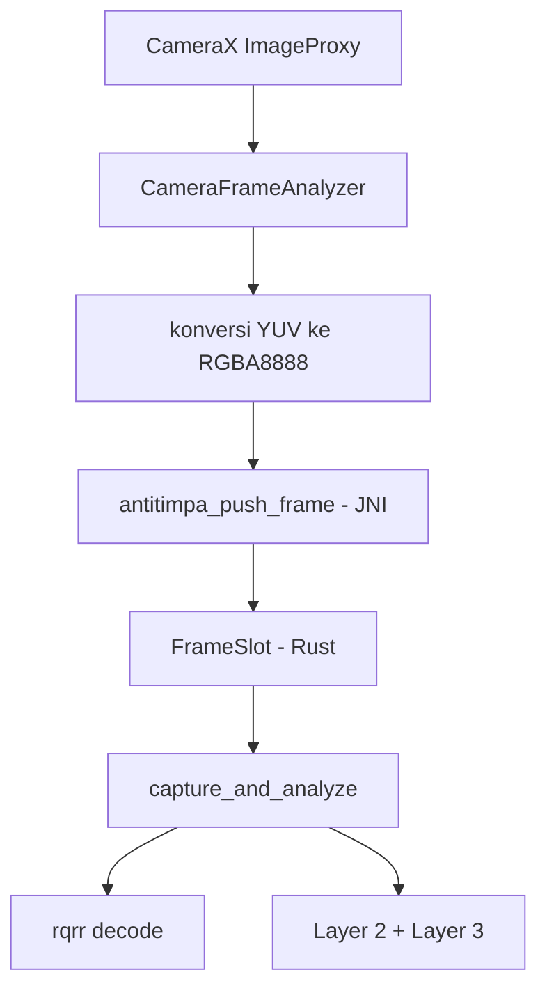

# Jembatan Kamera Native (Android)

Kode Kotlin di folder ini adalah separuh jembatan kamera; separuh Rust-nya ada di
`src-tauri/src/camera/mobile/android.rs`.

## Alur



## Mengapa begini

Tiga keputusan yang membedakan dari aplikasi Kivy lama:

1. **Analisis tidak lagi milik UI.** Versi lama merender video lewat widget Kivy,
   lalu analisis harus membaca balik piksel dari widget itu
   (`analyze_pixels_callback` → `_last_pixels`). Sekarang frame dikirim ke
   `FrameSlot` biasa, jadi UI bebas render dengan cara apa pun.

2. **Konversi YUV ke RGBA dilakukan di Kotlin, bukan Rust.** CameraX memberi
   `YUV_420_888` secara default. Konversinya memakai intrinsik JVM; menulisnya
   manual di Rust berarti mengimplementasikan ulang konversi warna dan mudah
   salah. Kode Rust menolak buffer bersalah-ukuran alih-alih membaca di luar
   batas.

3. **One-shot, bukan per-frame.** Frame terus dikirim, tapi slot hanya menyimpan
   yang terbaru. Tekan tombol → ambil satu frame → analisis. Ini mengikuti
   temuan aplikasi lama bahwa decode tiap frame bikin hang.

## Cara memasang

> **Status saat ini: sudah terpasang.** Keempat langkah di bawah sudah diterapkan
> di `src-tauri/gen/android/` pada repo ini, jadi bagian ini berfungsi sebagai
> catatan *apa yang harus diulang* bila `gen/` dibuat ulang dengan
> `npx tauri android init` (folder itu tidak masuk git).

### 1. Dependensi Gradle

Tambahkan ke `src-tauri/gen/android/app/build.gradle.kts` (terpasang, versi 1.4.2):

```kotlin
// CameraX: the capture side of the native camera bridge. Frames are
// analysed in Rust; CameraX only delivers them (see android/README.md).
val cameraxVersion = "1.4.2"
implementation("androidx.camera:camera-core:$cameraxVersion")
implementation("androidx.camera:camera-camera2:$cameraxVersion")
implementation("androidx.camera:camera-lifecycle:$cameraxVersion")
```

### 2. Izin kamera

Di `src-tauri/gen/android/app/src/main/AndroidManifest.xml` (terpasang):

```xml
<uses-permission android:name="android.permission.CAMERA" />
<uses-feature android:name="android.hardware.camera" android:required="false" />
```

`required="false"` disengaja: aplikasi tetap bisa berjalan di perangkat tanpa
kamera memakai backend sintetik, sama seperti aplikasi Kivy lama yang punya
mode simulasi.

### 3. Salin kode Kotlin

Salin `CameraFrameAnalyzer.kt` dan `CameraBridge.kt` ke
`src-tauri/gen/android/app/src/main/java/org/antitimpa/antitimpa/` (terpasang).

### 4. Panggil dari Activity

```kotlin
class MainActivity : TauriActivity() {
    private lateinit var cameraBridge: CameraBridge

    override fun onCreate(savedInstanceState: Bundle?) {
        super.onCreate(savedInstanceState)
        cameraBridge = CameraBridge(this, this)

        // Minta izin dulu, baru mulai — supaya prompt terikat aksi pengguna.
        if (cameraBridge.hasPermission()) {
            cameraBridge.start()
        } else {
            registerForActivityResult(ActivityResultContracts.RequestPermission()) { granted ->
                if (granted) cameraBridge.start()
                else Log.e("ANTITIMPA", "[camera] izin ditolak pengguna")
            }.launch(Manifest.permission.CAMERA)
        }
    }

    override fun onDestroy() {
        cameraBridge.stop()
        super.onDestroy()
    }
}
```

### 5. Nama library

`CameraBridge` memanggil `System.loadLibrary("anti_timpa_lib")`. Nama ini berasal
dari `[lib] name` di `Cargo.toml`. Kalau kamu mengubahnya, ubah juga di sini.

## Diagnostik

Semua log memakai tag `ANTITIMPA`, sama seperti aplikasi Kivy lama:

```bash
adb logcat -s ANTITIMPA
```

Yang bisa dibedakan dari log:

| Gejala di log | Artinya |
|---|---|
| `native belum pernah mengirim frame sama sekali` | Jembatan belum terpasang — `start()` tidak dipanggil atau JNI gagal |
| `buffer terlalu kecil; butuh N byte` | Frame bukan RGBA8888 — cek `setOutputImageFormat` |
| `izin CAMERA belum diberikan` | Prompt izin ditolak atau belum diminta |
| `gagal memulai CameraX` | Kamera tidak bisa di-bind (dipakai proses lain / tidak ada kamera) |
| `push_frame: dimensi tidak valid` | `ImageProxy` memberi dimensi 0 — sesi belum siap |

Untuk log per-frame, set `ANTITIMPA_CAM_DEBUG=1` di environment sebelum
menjalankan aplikasi.

## Yang belum diverifikasi

Kode Kotlin ini **belum pernah dikompilasi atau dijalankan di perangkat**,
karena butuh toolchain Android dan build penuh. Yang sudah terverifikasi adalah
sisi Rust-nya: 19 test di `android.rs` berjalan di host Linux (lewat fitur
`jni-bridge`) dan mencakup penolakan pointer null, buffer bersalah-ukuran,
dimensi nol, pemetaan rotasi, serta kepemilikan buffer setelah sumbernya
di-drop.

Validasi berikutnya yang perlu dilakukan di perangkat nyata:

1. `adb logcat -s ANTITIMPA` menampilkan `sesi CameraX aktif`.
2. `antitimpa_frames_received()` bertambah setelah `start()`.
3. Tekan tombol capture → muncul skor, bukan pesan "belum ada frame".
