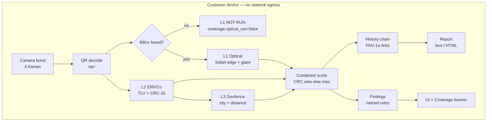

# ANTI TIMPA — On-Device QRIS Tamper Detection

**HackNusa 2026 · Project Report**

| | |
|---|---|
| **Project** | Anti Timpa QRIS Scanner |
| **Track** | Cybersecurity / Trust & Safety in Digital Payments |
| **Repository** | `anti-timpa/` (Rust + Tauri + React) |
| **Runner-up deliverable** | `docs/PITCH_DECK.md` (presentation outline) |

---

## Chapter 1 — Introduction & Background

### 1.1 The problem

QRIS (Quick Response Code Indonesian Standard) is the national QR payment
standard operated by Bank Indonesia, and it is now the default way small
merchants in Indonesia accept non-cash payment. Adoption is large and the
physical artefact is trivially replaceable: a QRIS code is a printed sheet of
paper, a laminated card, or a sticker on a food cart.

That combination — high value, trivially swappable token — creates a specific
attack that is already widespread:

> The **QRIS overlay attack**. The attacker prints their own QRIS code as a
> sticker and pastes it over the merchant's. The customer scans, sees a normal
> payment screen with a plausible amount, and pays the attacker.

The customer's device displays the *merchant name and city embedded in the QR*.
The attacker simply uses a merchant name that looks like the real one. The
customer's bank confirms only that the QR is a valid QRIS code — which it is,
because it is the attacker's genuine code.

### 1.2 Why existing defences do not catch it

The security checks that exist in the payment flow are all, necessarily,
**payload-level**:

| Existing check | What it verifies | Why an overlay defeats it |
|---|---|---|
| CRC-16 / Tag 63 | The payload was not altered after generation | The attacker's payload is internally consistent; it was never altered |
| TLV structure | The code is well-formed EMVCo | The attacker's code is well-formed |
| Merchant name display | Tells the customer who they are paying | The name is attacker-chosen and made to look familiar |
| Bank confirmation | The QR is a registered QRIS code | It *is* registered — to the attacker |

Every one of these examines the **data**. None examines the **physical object**.
An overlay changes the object and leaves the data untouched, so the attack is
structurally invisible to the entire existing stack.

### 1.3 The gap this project addresses

There is no on-device tool that tells a customer *"the paper in front of you has
been tampered with"* before they pay. Consumer options today are limited to
"notice that the sticker looks odd" — which is exactly the judgement a hurried
customer cannot make.

Anti Timpa closes that gap by analysing the **object as well as the data**, on
the customer's own device, with no upload, no account, and no dependence on the
merchant's or the acquirer's infrastructure.

### 1.4 Track alignment

The project addresses trust in digital payment infrastructure from the
**end-user's** side, which is where the overlay attack actually lands. It is
deployable without requiring any change to the QRIS rails themselves, so it does
not depend on Bank Indonesia or an acquirer adopting it first.

---

## Chapter 2 — Solution Overview & Market Differentiation

### 2.1 What it is

A cross-platform application (desktop, Android, iOS from one Rust + React
codebase) that scans a QRIS code and returns a risk verdict backed by three
independent analyses: two of the payload and one of the physical image.

### 2.2 The three layers and what each can actually prove

The central design decision is honesty about what each layer establishes. A
security tool that overstates its own coverage is worse than no tool.

| Layer | Question it answers | Can it detect an overlay? | Evidence strength |
|---|---|---|---|
| **L1 Optical** | Is the *object* an untouched QR, or has something been pasted over it? | **Yes — the only layer that can** | Strong within its scope |
| **L2 EMVCo** | Is the *payload* internally consistent and plausible? | No — an overlay's payload is valid | Strong, but blind to the attack |
| **L3 Geofence** | Is the *location* implausible for this merchant? | No | Weak, corroborating |

**L1 is the product.** L2 and L3 are included because they are cheap and
occasionally conclusive (a payload whose CRC fails *is* tampered), but the
unique capability is optical.

### 2.3 Unique Selling Proposition

1. **It is the only check that examines the physical object.** Every competing
   control operates on data. There is no alternative that addresses the overlay
   attack at all.

2. **100% on-device — architecturally enforced, not promised.** The app has no
   server component. The Tauri Content Security Policy is `default-src 'self'`
   with no network origins and no external asset sources, so the WebView cannot
   reach the network even if a dependency tried to. There is nothing to breach
   because there is no back end to breach.

3. **It reports its own coverage.** A payload-only scan returns
   `coverage.optical_ran = false` and the UI renders a warning banner rather
   than a green verdict (see §3.6). Competitors present a single score with no
   indication of what produced it.

4. **It refuses to compare when comparison is meaningless.** Layer 3 returns
   `NOT COMPARABLE` for e-commerce QRIS codes that carry a service descriptor
   where a city should be, and returns `NOT RUN` when location is unavailable —
   rather than scoring a false zero that would read as "checked and fine".

5. **It is offline-capable by construction.** Airplane mode, poor signal, and
   the merchant's basement all work identically.

### 2.4 Competitive positioning

| Alternative | Why it does not cover this |
|---|---|
| Bank / PSP app QR scanners | Payload validation only; cannot see the physical code |
| QR scanner apps (generic) | Decode and open a URL; no security analysis at all |
| Card-network anti-fraud | Operates post-transaction, at the issuer, on aggregate patterns |
| Educating users to "look closely" | Unreliable under time pressure; the whole point of the attack |
| Tamper-evident printed labels / holograms | Merchant-side cost; no verification by the paying customer |
| Bank Indonesia QRIS standard changes | Would require ecosystem-wide rollout; does not help today |

---

## Chapter 3 — Proof of Concept Implementation

### 3.1 Stack and why

| Component | Technology | Why this choice |
|---|---|---|
| Core analysis | **Rust** | Runs unchanged on desktop, Android, and iOS; no GC pauses during frame analysis; memory-safe for code parsing attacker-controlled input |
| App shell | **Tauri 2** | Native app with a strict CSP and no bundled Node runtime; the security boundary is the OS, not a browser sandbox |
| UI | **React 18 + TypeScript** | Fast iteration; typed IPC contract |
| QR decode | `rqrr` (pure Rust) | No OpenCV/Python dependency; decodes in-process |
| Image import | `image` (PNG/JPEG, format sniffing) | Runs the optical layer on a photo without a camera |
| QR encode | `qrcode` (dev only, `qr-encode` feature) | Lets the synthetic backend emit **real, decodable** symbols |
| Camera (desktop) | `nokhwa` | V4L2 / AVFoundation / MSMF |
| Camera (mobile) | CameraX via JNI | Frames pushed from native into a Rust slot |

### 3.2 Layer 1 — Optical tamper analysis (the core contribution)

Implemented in `src-tauri/src/layer1_optical.rs`.

**Signal 1 — edge density in the detection ring.**
A QR symbol requires a blank margin. An attacker's sticker must be *larger* than
the symbol, otherwise the original code would still decode around it. So the
sticker's border necessarily lands in the ring just outside the symbol, as a
straight high-contrast line where blank paper should be. Measured as the
fraction of pixels in that ring whose Sobel gradient exceeds a noise floor.

The ring width is the most sensitive parameter in the layer, and it was fitted
by measurement rather than chosen. The recorded sweep (`EDGE_MAGNITUDE_THRESHOLD`
= 24):

| Ring band (× symbol side) | clean QR | QR with sticker |
|---|---|---|
| 0.03 | 0.1394 | 0.1394 |
| 0.05 | 0.0797 | 0.5079 |
| 0.06 | 0.0678 | 0.4319 |
| 0.08 | 0.0490 | 0.4219 |
| 0.10 | 0.0380 | 0.3277 |
| **0.12** | **0.0321** | **0.2767** |
| 0.14 | 0.0932 | 0.2969 |

At 0.03 and 0.14 the ring clips the paper-to-background boundary of the sheet
itself, so a *clean* code reads as heavily anomalous (0.139 / 0.093). **0.12**
sits between both failure modes and retains ~8.6× separation.

**Signal 2 — specular glare in the ring.**
A sticker is a different material (glossy thermal print, adhesive film). Across
a burst of frames the share of specular pixels in the ring varies, where paper's
does not.

**Signal 3 — texture discontinuity (measured, reported, deliberately not scored).**
The peak 3×3 local variance over the symbol interior. On any *readable* QR the
interior is full of printed modules, so this metric saturates (9800 = 99²) and
cannot discriminate. It is computed and returned in `Layer1Result` because it is
the right shape of signal to re-fit against real captures — but it carries zero
weight, and the code says so. **Shipping a weight that is known to be noise
would be worse than omitting it.**

**Scoring.** `l1_score = 0.70 × spatial + 0.30 × disagreement`, where spatial is
`0.75 × edge + 0.25 × glare`, plus a bounded temporal bonus (`TEMPORAL_BOOST =
0.35`) that can raise a score but never convict alone.

Measured on the fixtures: clean **0.000 / LOW RISK**, sticker **0.371 / CAUTION**.

### 3.3 The honest limitation of Layer 1 — and why it is stated

The sticker fixture does **not** reach HIGH RISK, and the thresholds were not
lowered to make it. The fixture's overlay also covers part of the symbol, which
is a moderate violation; forcing it into HIGH RISK would require thresholds that
start flagging clean codes. HIGH RISK is reserved for margins far more severely
violated than this fixture. The test asserts "at least CAUTION", and the
reasoning is recorded on the constant.

This is the trade-off in §4.5: for this threat model a missed overlay costs the
user real money, while a false alarm costs a re-scan. The thresholds therefore
lean toward sensitivity — but not so far that clean codes trip.

### 3.4 Layer 2 — EMVCo payload integrity

Implemented in `src-tauri/src/layer2_emvco.rs`. Flat and nested TLV parsing
(tags 26–51), CRC-16/CCITT-FALSE, and four risk rules: format indicator, currency
and country, dynamic QR in a physical-scan context, and charity-MCC paired with a
commercial merchant name. A CRC failure is a **hard veto** forcing the combined
score to 1.0 — the one case where a payload check is genuinely conclusive.

### 3.5 Layer 3 — Geographic plausibility (rebuilt)

Implemented in `src-tauri/src/layer3_geofence.rs`, with `src-tauri/src/geo_table.rs`
for offline city resolution.

**The problem with the original rule.** It was `client_city != merchant_city →
score 1.0 → HIGH RISK`. Because the combined score is `max(l1, l2, l3)`, that
alone forced the app's headline verdict to HIGH RISK. It fired hardest on
people behaving normally: any traveller scanning a legitimate national-chain
QRIS. It was the largest false-positive source in the pipeline.

Worse, it did not address the attack. An overlay copies Tag 60 verbatim, so the
merchant city is genuine and Layer 3 sees nothing.

**The rebuilt layer** replaces the flat rule with classification:

| Outcome | Score | Meaning |
|---|---|---|
| `MATCH` | 0.00 | Names agree after normalisation |
| `SAME_METRO` | 0.00 | Different name, same place (`KOTA/KABUPATEN` levels, aliases) |
| `NOT_COMPARABLE` | 0.00 | Tag 60 is non-ASCII, or a non-geographic marker (`ONLINE`) |
| `NOT_EVALUATED` | 0.00 | An input is missing — **explicitly not a pass** |
| `DIFFERENT_CITY_NEARBY` | 0.40 | Far apart by name, within ~150 km, or a land-border city |
| `DIFFERENT_CITY_DISTANT` | 0.65 | Different name and measurably far |
| `DIFFERENT_CITY_UNBOUNDED` | 0.55 | Different name, no reference data to bound it |

Distance is Haversine, computed from a device fix when the user opts in,
otherwise from city reference points. `(0,0)` and out-of-range fixes are
rejected as placeholders. **No path in this layer can reach the HIGH RISK
band** — enforced by a test that asserts exactly that across four mismatch
shapes, so a future retune cannot silently reintroduce the veto.

#### Making the layer run at all — a second, independent bug

Building the classification above was not sufficient. In practice Layer 3
reported `NOT RUN` on **every** scan, for two unrelated reasons:

1. **The UI called `navigator.geolocation`, which a Tauri WebView cannot back
   with a real service.** On Linux, WebKitGTK's geolocation provider is not wired
to anything, so the call errors, the error handler swallowed it, and the scan
   received no location. The UI still displayed a location checkbox, so the
   feature *looked* present while the data never arrived. Fixed by using
   `@tauri-apps/plugin-geolocation` on mobile, which talks to the OS service and
   produces a real permission prompt.
2. **A typed city resolved no coordinates.** The payload-only path accepted a
   city name but performed no lookup, so even with a location supplied there was
   nothing to measure a distance from. Fixed by resolving the typed name against
   the bundled offline table in `geo_table.rs`.

The platform split is now explicit, and the reasoning matters:

| Platform | Location source | Why |
|---|---|---|
| Android / iOS | OS service via the geolocation plugin | The only true position, with a real permission prompt |
| Desktop | Offline city table, from the typed city | Desktop has **no** OS location service. IP geolocation was rejected because it would send the user's position to a third party, breaking the app's core guarantee |
| Browser (`npm run dev`) | `navigator.geolocation`, best-effort | Keeps UI work possible outside Tauri; not a supported path |

The desktop choice is the one worth defending. Asking a third-party service where
the user is would contradict the entire premise of an app whose selling point is
that nothing leaves the device — and the comparison only needs *city* resolution,
not coordinates. Typing one word costs less than a privacy leak.

A consequence worth stating: on desktop, Layer 3 now runs whenever a known city
is typed, with **no permission and no network**. Four tests pin this, including
the negative case — a city outside the table still evaluates by name and reports
`DIFFERENT_CITY_UNBOUNDED` rather than claiming the check passed.

### 3.6 Coverage reporting and named findings

`ScanSnapshot` carries two fields that exist specifically to prevent a partial
scan from being misread as a clean one:

- **`coverage`** — which layers ran, and `complete: bool`.
- **`findings`** — a ranked list of rules that fired, each with a stable code
  (`L2_CRC_MISMATCH`, `L1_OPTICAL_TAMPER`, …).

The `CoverageBanner` component renders a partial scan as a **warning**, not a
success, and names exactly what was skipped. This matters because a
payload-only scan of an overlaid QR legitimately returns `LOW RISK` — every
payload check passes. Without the banner the app would tell the user their code
is clean while the only check that could have caught the attack never ran.

### 3.7 Camera pipeline

`capture_and_analyze` captures a **burst of 4 frames** (`DEFAULT_BURST_FRAMES`),
because a single frame cannot distinguish a moving highlight from a static bright
patch. Burst capture is best-effort: if the device delivers fewer frames, Layer 1
degrades to spatial-only and reports that the temporal term was skipped, rather
than failing the scan.

Layer 1 runs **only when a QR was decoded**, because without a bounding box
there is no margin to measure and reporting a score anyway would be precisely the
false-clean result the layer exists to prevent.

### 3.8 Image import — a validation path, not a product feature

Implemented in `src-tauri/src/image_import.rs`.

This module is deliberately framed as what it is: **the way Layer 1 gets
validated against real photographs, and demonstrated on a machine with no camera
and no printed sticker.** It is not the primary detection path. The overlay
attack happens at a physical QR in front of a camera, and `capture_and_analyze`
is the function that addresses it.

The honest constraint, enforced rather than papered over: **a single imported
photo cannot support the temporal glare check**, because that needs a burst of
frames of the same untouched scene. The obvious cheat — re-analysing one image
four times and reporting the resulting zero variance as "no glare risk" — would
manufacture a measurement. Instead `ImportInfo.imported_frame_has_burst` is
hard-coded `false`, Layer 1 runs spatial-only, and the skipped temporal check
appears in the result's warnings.

What it does provide:

- **Format-agnostic decoding** via `ImageReader::with_guessed_format()`, because a
  file picked from disk frequently has no useful extension.
- **A resolution band** (`MAX_IMPORT_DIMENSION = 1600`). A modern phone photo is
  4000+ px and ~48 MB decoded. Layer 1's geometry is scale-invariant, so
  downscaling costs no signal — and it keeps imported frames in the same
  resolution regime as camera frames, which is what makes measurements from the
  two paths comparable at all.
- **Conditional resampling.** Upscaling and unnecessary resize are both avoided;
  a needless resample would blur the fine margin detail Layer 1 exists to
  measure.

### 3.9 Evidence layer (new)

- **`history.rs`** — an in-memory, session-scoped scan log with a tamper-evident
  hash chain. Each entry's hash covers its own canonical encoding plus the
  previous entry's hash, so editing or removing an entry breaks every hash after
  it. Field values are length-prefixed in the hashed encoding to close
  boundary-ambiguity collisions. The buffer is capped at 200 entries.
- **`report.rs`** — generates a shareable evidence document in text or
  self-contained HTML. The report **always lists the layers that did not run**,
  and escapes attacker-controlled values (a merchant name comes from the QR).

### 3.10 Verified status

| Check | Command | Result |
|---|---|---|
| Core tests | `cargo test --no-default-features --features "jni-bridge,qr-encode" --lib` | **143 passed, 0 failed** |
| Core tests (no encoder) | `cargo test --no-default-features --features jni-bridge --lib` | **131 passed, 0 failed** |
| Desktop compile | `cargo check --features desktop-camera,jni-bridge,geolocation` | Clean, no warnings |
| Frontend types | `npx tsc --noEmit` | Clean |
| Frontend build | `npm run build` | Clean |

The `qr-encode` feature is off by default, so a plain `cargo test` runs without
it and the generated project excludes the encoder from the shipping binary
entirely — the product only ever *reads* QR codes.

Fixture results in the current build (real symbol rendered by the synthetic
backend, 640×480):

```
clean QR      : payload=106B  edge=0.0162  score=0.000  band=LOW RISK
sticker QR    : payload=106B (IDENTICAL) edge=0.2767  score=0.371  band=CAUTION
CRC tampered  :                                         score=1.000  band=HIGH RISK (veto)
traveller     : L3 DIFFERENT_CITY_DISTANT               score=0.650  band=CAUTION (no veto)
imported photo: downscaled 3200px -> 1600px, decodes, L1 runs spatial-only
```

Note the line that matters most: the clean and stickered frames carry the
**same payload**. That is the attack, and it is why Layer 1 is the product.

### 3.11 Repository map

```
src-tauri/src/
├── lib.rs               command surface, combined scoring, findings synthesis
├── layer1_optical.rs    ★ optical tamper analysis (Sobel, glare, scoring)
├── layer2_emvco.rs      TLV parsing, CRC-16, four payload risk rules
├── layer3_geofence.rs   ★ geographic plausibility classification
├── geo_table.rs         ★ offline city coordinates (desktop location)
├── image_import.rs      ★ photo import for Layer 1 validation/demo
├── history.rs           tamper-evident session scan chain
├── report.rs            on-device shareable report (text + HTML)
├── qr.rs                QR decode (rqrr)
└── camera/              backend trait: desktop / mobile / synthetic
src/
├── App.tsx              orchestration
├── api.ts               typed IPC surface
├── location.ts          ★ per-platform location resolution
├── types.ts             mirrored Rust types
└── components/
    ├── CoverageBanner.tsx    ★ partial-scan warning
    ├── FindingsList.tsx      ★ named findings
    ├── ReportPanel.tsx       ★ report generation
    ├── HistoryPanel.tsx      ★ history + chain verification
    └── ImageImportPanel.tsx  ★ photo import
```

---

## Chapter 4 — Technical Architecture & Feasibility

### 4.1 System architecture



### 4.2 Data flow and trust boundaries

The critical architectural property is that **no trust boundary is crossed at
runtime**. The only boundary is the IPC seam between the React WebView and the
Rust core, which is an in-process channel in the same application:

| Boundary | Protocol | Data crossing | Trust assumption |
|---|---|---|---|
| WebView → Rust core | Tauri IPC (in-process) | Payload string, frame metadata, snapshot JSON | Same process, same user |
| Rust → camera | OS device API | Pixel buffers | OS-enforced permissions |
| Rust → network | **none** | **nothing** | CSP `default-src 'self'` |

Raw pixels never cross into the WebView for analysis. The preview path sends
downscaled JPEG data URLs purely for display, and the analysis always runs on the
full-resolution frame in Rust — analysing a downscaled JPEG would destroy the
fine edge detail Layer 1 depends on.

### 4.3 Why Rust

| Requirement | Consequence of the choice |
|---|---|
| One analysis implementation for desktop + Android + iOS | No platform-specific reimplementation to drift out of sync |
| Bounded latency during frame analysis | No GC pause in the middle of a burst |
| Parses attacker-controlled input (TLV from a QR) | Memory safety removes the injection class entirely |
| Camera frames are large, per-frame copies are costly | Zero-copy buffer handling, explicit ownership |

### 4.4 The synthetic backend as a feasibility strategy

`camera/synthetic.rs` generates deterministic frames containing a QR symbol with
configurable sticker anomaly and glare. This is not a fallback convenience — it
is what makes the optical layer **testable at all**. Every Layer 1 threshold in
this report was fitted against measurable fixture output, and the calibration
invariant is enforced by a test
(`edge_limit_sits_between_clean_and_sticker_measurements`) that fails if a
constant is retuned such that the limit no longer separates the two fixtures.

The backend originally drew a *geometric stand-in* rather than a real symbol,
which made every test stop before the decode step (see §5.5). It now renders real
QR codes via `qrcode`, gated behind an off-by-default `qr-encode` feature so the
shipping binary never links an encoder it does not use. Two consequences:

- Layer 1 is now tested **on frames that actually contain a QR**, which is the
  only way to verify the frame → decode → analysis chain.
- The fixture can carry a real QRIS payload, so the *identical payload* property
  of the overlay attack is an executable assertion rather than a claim.

Without the synthetic backend, an optical threshold can only be tuned by pointing
a camera at paper and guessing. With it, tuning is a measurement.

### 4.5 Threshold selection and the cost asymmetry

Two errors are possible and they are not symmetric:

| Error | Cost | Mitigation |
|---|---|---|
| **False negative** (missed overlay) | Customer pays the attacker. Direct financial loss. | Thresholds lean sensitive; HIGH RISK band kept reachable |
| **False positive** (clean code flagged) | Re-scan, mild annoyance, erosion of trust | Calibrated limits ~2× the clean measurement; HIGH RISK reserved for severe violations |

For this threat model the false negative is far more expensive, which is why the
design accepts a CAUTION verdict on moderate violations rather than demanding
certainty. The trade-off is made explicit rather than hidden.

### 4.6 Known limitations — stated deliberately

1. **Thresholds are fitted on synthetic fixtures, not field captures.** They are
   expressed as multiples of measured values so a re-fit is a constant change,
   and all raw metrics are surfaced in `Layer1Result` so that re-fit needs no
   code change. **This is the highest-priority validation gap.**
2. **The city table is small** (~12 entries covering the demo corridor) with
   city-centre approximations, not the ~514 Indonesian kabupaten/kota.
3. **The `imported_image` path now exists but needs field validation.** Layer 1
   runs on an imported photo, but the thresholds remain synthetic-fitted. Import
   is the tool for closing this gap, not a substitute for closing it.
4. **Windows and macOS builds are unverified**; Android was verified on-device
   (Samsung A14, Android 15) for the camera bridge only.
5. **Layer 1 cannot see through blur or at extreme angles.** The
   `quiet_zone_truncated` flag reports when the margin was not measurable, but
   does not fix it.
6. **The detector has not been tested against a real overlay photograph.** Every
   result in this report comes from a rendered fixture. This is the single
   largest unknown, and it is also the cheapest to close: one afternoon with a
   printer and ten phones would answer it.

### 4.7 Feasibility summary

Every external dependency is a mainstream, maintained crate or plugin. The
architecture requires no cloud service, no account system, no proprietary SDK,
and no hardware beyond a camera the device already has. The hardest remaining
work is **data collection and threshold fitting**, not engineering risk — which
is the favourable side of the risk ledger.

---

## Chapter 5 — Security Architecture & IP Potential

### 5.1 Threat model

**Asset.** The customer's payment intent — protecting them from paying the wrong
party.

**Adversary.**

| Adversary | Capability | Goal |
|---|---|---|
| **A1: Overlay attacker** (primary) | Prints and pastes a valid QRIS sticker; controls the merchant name in it | Redirect payment |
| **A2: Payload forger** | Crafts a QRIS payload with arbitrary fields | Appear legitimate while anomalous |
| **A3: Local attacker** | Can modify app storage or the session history | Hide evidence of a scan |
| **A4: Curious third party** | Observes network traffic or device storage | Learn user location or what they scanned |

**Explicitly out of scope.** Malware with device control (it can defeat any
on-device check), a compromised OS camera stack, and social engineering that
convinces the user to ignore the warning.

### 5.2 Controls, per adversary

**Against A1 (the core case).** Layer 1 edge-density and glare analysis is the
only control in the stack that examines the physical artefact. Note the honest
boundary: this detects *presence of an overlay*, not *whose* overlay. A
determined attacker who reproduces the exact sticker geometry could defeat it.
This is why the verdict is advisory and paired with "confirm with the merchant".

**Against A2.** CRC-16 plus four plausibility rules, with a hard veto on CRC
failure. Parsing is in Rust, so a malformed N-length TLV cannot cause memory
unsafety. Total length is bounded.

**Against A3.** The history hash chain makes post-hoc edits and deletions
detectable, and the verification is user-invocable from the UI.
**Limitation stated plainly:** the hash is FNV-1a, unkeyed. An attacker who can
rewrite the entire buffer can also recompute the entire chain. This is
tamper-*evidence*, not tamper-*proofing*, and the code says so. A keyed HMAC
would not fix this either — with no server and no key storage, the key would
sit on the same device. Real tamper-proofing requires an external anchor.

**Against A4.** No network egress, enforced at the WebView CSP layer; no
persistent storage of scans; report generation is local and the user's own copy
action is the only egress path; GPS is explicitly opt-in with
`enableHighAccuracy: false` so only a coarse fix is requested. On desktop no
location permission is needed at all, because the city comes from a table bundled
in the binary rather than from a service. The history stores a 24-character
payload preview, not the full payload, so the log cannot become a complete record
of everything scanned.

### 5.3 Security properties of the implementation

| Property | Mechanism |
|---|---|
| No external attack surface | No server, no listening port, no network calls |
| Network egress impossible | CSP `default-src 'self'`; only `img-src` relaxes to `blob:`/`data:` |
| No secret to leak | No API key, no embedded credential, no account |
| Injection-resistant | Rust memory safety on all parsed input; report HTML escapes merchant names and the payload |
| Least privilege on location | Opt-in, coarse-only, never persisted, never transmitted. Mobile asks the OS only when a scan runs; desktop needs no permission at all because it resolves from the typed city against an offline table |
| Explicit coverage | `coverage` + `findings` make partial checks visible rather than implied complete |

**Note on report HTML.** The report embeds a merchant name that originates from a
QR code — i.e. attacker-controlled. A test asserts that
`<script>alert(1)</script>` as a merchant name is escaped in the output, because
without escaping the evidence document would be an injection vector.

### 5.4 Intellectual property potential — an honest assessment

**A patent is unlikely, and the earlier draft of this section overstated the
case.** No patent search was performed, so the following is reasoning, not a
legal opinion:

- The individual techniques — Sobel edge density, local intensity variance,
  specular-glare detection across frames — are decades-old computer vision, and
  are not novel.
- Applying those techniques to QR codes is a routine transfer of a known method
  to a new domain. Novelty usually has to reside in the *method*, not in the
  choice of input.
- On that basis a patent filing would most likely fail on prior art, and the
  cost is not justified at this stage.

**What is actually defensible:**

| Asset | Strength | Why |
|---|---|---|
| **Labelled capture dataset** | Strong | Cannot be bought; must be collected. This is the real moat, and it grows with use |
| **Fitted thresholds + ring geometry** | Moderate | A competitor must re-derive them empirically; they are not published in any standard |
| **Recorded negative results** | Strong for judges, not for IP | The documented failure modes (see below) are know-how |
| **The three-layer architecture** | None | Abstract idea, and Layer 2 is fully specified by EMVCo |

**Recommendation.** Do not pursue a patent. Invest instead in the dataset and in
publishing the negative results, which is what earns technical credibility — and
is also the foundation for a possible defensive publication later if a
competitor appears.

### 5.5 A negative result worth recording

While building the image-import path, a test asserted that a rendered QR survives
a PNG round trip. It failed. The cause was not the import code: **the synthetic
camera backend never rendered a real QR symbol.** It drew a border and three
finder-pattern squares — visually plausible, geometrically convenient, and not a
valid code.

The consequence was larger than the failing test. Because the fixture could
never decode, **no test in the project reached the decode step.** The entire
frame → decode → Layer 1 → Layer 2 chain was unverified, and an end-to-end
regression would have surfaced as `no_qr_reason` — indistinguishable from a user
who aimed badly, and therefore invisible during development.

The backend now renders real symbols via the `qrcode` crate behind an off-by-
default `qr-encode` feature, and two tests cover the seam:

- `synthetic_frame_reaches_the_payload_layers_end_to_end` — a frame decodes to the
  exact payload encoded, Layer 1 runs, and Layer 2 validates the CRC and reads
  both Tag 59 and Tag 60.
- `sticker_preserves_the_payload_but_moves_the_optical_score` — **the project's
  central claim, as an executable assertion:** the clean and stickered frames
  produce byte-identical payloads while Layer 1 scores them differently.

This is recorded rather than quietly fixed because it is the most instructive
finding of the build, and because a test suite that is green while never
reaching the critical path is a failure mode worth naming.

### 5.6 Intellectual-property risk of the detection method

The method is published in this report and in the repository. That makes it
defensively disclosed — which costs nothing here, because it was not patentable —
but it also means an attacker can adapt. The counter is that Layer 1 detects
*arbitrary* extra edges in the margin, not one specific sticker geometry, so
avoidance requires the overlay to leave the quiet zone pristine, which is exactly
what an overlay cannot do while remaining opaque.

---

## Chapter 6 — Scalability & Deployment Roadmap

### 6.1 Why this scales unusually cheaply

The architecture has **no server-side scaling problem**, because it has no
server. Cost per user is zero marginal infrastructure. Scaling to a million
users requires no capacity planning, no database, and no CDN for scan traffic.

| Scaling dimension | Behaviour | Bottleneck if reached |
|---|---|---|
| Concurrent users | Independent; no shared resource | App store distribution only |
| Scan volume | Linear in device compute | None server-side |
| Geographies | Add city reference data | Gazetteer completeness (data task) |
| Merchant coverage | Increases with user base | None |
| Report generation | Local; no queue | Device CPU, trivial |

### 6.2 Performance

| Stage | Cost | Notes |
|---|---|---|
| Burst capture (4 frames) | Dominated by camera shutter | ~4× single capture |
| QR decode | Milliseconds (rqrr, pure Rust) | Once per burst |
| Sobel + ring metrics | O(W×H), once per burst for gradients | Stride-sampled texture keeps it flat on phones |
| Layer 2 TLV + CRC | Microseconds | String work only |
| Layer 3 | Microseconds + Haversine | 12-entry table lookup |
| Preview encode | ~40–80 KB JPEG per frame | Capped frame rate; paused during analysis |

The one design concession for phones: preview and analysis share a single camera
device, so preview is **paused during capture** via an RAII guard
(`AnalysisGuard`). Without it, a preview tick landing mid-capture makes the scan
fail intermittently — the worst class of bug to diagnose.

### 6.3 Deployment roadmap

**Phase 0 — Current (PoC complete).**
Three layers running. 129 tests, including an end-to-end assertion on real
rendered symbols. Camera bridge verified on Android hardware. Image import path
working. Thresholds synthetic-fitted. Windows/macOS unverified.

**Phase 1 — Field calibration (highest priority, ~4–6 weeks).**
Print a real QRIS code, paste an overlay over it, photograph both under ≥4
lighting conditions on ≥10 device models, and import the photos through the path
built in this phase. Refit the four Layer 1 constants. Publish a
precision/recall table per condition. **This is what converts a proof of concept
into a validated detector**, and the import path exists specifically to make it
afternoon-work rather than a hardware project.

**Phase 2 — Platform completion (~4–6 weeks).**
iOS AVFoundation bridge; Windows/macOS build verification; EXIF orientation
handling for imported photos; hardening against blur and extreme angles.

**Phase 3 — Adoption (~3 months).**
Two realistic deployment paths:
1. **Standalone app** — direct distribution; immediately usable.
2. **SDK for PSP/bank apps** — expose the Rust core as a library so QRIS
   scanning inside an existing banking app gains the optical check. This is the
   higher-impact path: it reaches users without a new install, and the
   integration surface is one function call.

**Phase 4 — Ecosystem.**
Full Indonesian gazetteer; optional opt-in corroboration (a reported QRIS
identifier seen repeatedly, which would *not* require uploading scan images);
standardisation engagement with Bank Indonesia on an on-device tamper signal.

### 6.4 Infrastructure requirements

| Component | Development | Production |
|---|---|---|
| Analysis backend | none | **none** |
| Build/CI | 1 runner, Rust + Node toolchain | Same |
| Distribution | — | App stores; app size ~10–15 MB |
| Data | Synthetic fixtures (real rendered QR symbols) | Labelled field-capture dataset (~10⁴ images) |
| Optional corroboration service | — | Only if Phase 4 is pursued; deliberately a separate, opt-in surface |

### 6.5 Commercial sustainability

Because marginal cost is zero, the model does not need per-scan revenue:

- **B2B SDK licensing** to PSPs and banks — they already have the distribution
  and a direct financial interest in reducing overlay fraud.
- **White-label** for acquirers offering merchant protection.
- **Public-interest free tier** — the standalone app, funded by the above.

### 6.6 Conclusion

Anti Timpa addresses a real, widespread, and currently unaddressed attack by
looking at the one thing every existing control ignores: the physical object.
It does so with no server, no upload, and no account, so the privacy and
security claims are architectural rather than policy promises. The engineering
risk is low — the remaining work is data collection and calibration, not
feasibility. And the honest coverage reporting means the tool states what it has
not checked, which is the minimum standard for a security product that people
will rely on to decide whether to send money.
