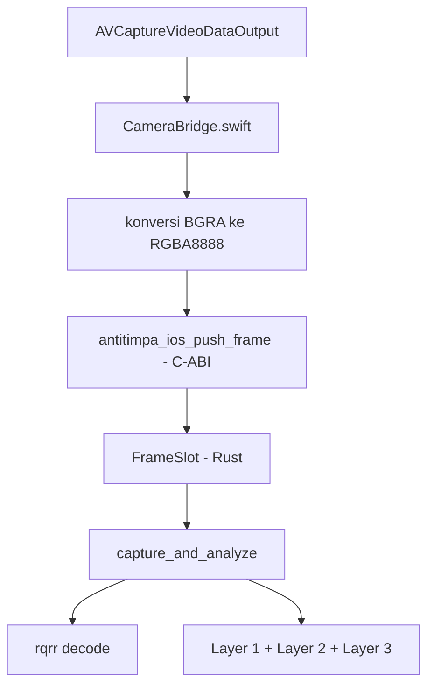

# Jembatan Kamera Native (iOS)

Kode Swift di folder ini adalah separuh jembatan kamera iOS; separuh Rust-nya ada
di `src-tauri/src/camera/mobile/ios.rs`.

> Status: ini scaffold siap-compile, belum terverifikasi. Berkas Swift ini belum
> pernah dikompilasi atau dijalankan karena membutuhkan macOS + Xcode. Sisi
> Rust-nya sudah diuji di host (lewat fitur `ios-bridge`). Rincian ada di bagian
> [Yang sudah vs belum diverifikasi](#yang-sudah-vs-belum-diverifikasi).

## Alur



## Mengapa C-ABI, bukan JNI

Android mencapai Rust lewat JVM, jadi titik masuknya adalah fungsi JNI dengan nama
ter-*mangle* (`Java_org_antitimpa_...`). iOS tidak punya runtime semacam itu:
Swift menautkan pustaka statis Rust langsung dan memanggil simbol `extern "C"`
biasa. Karena itu `ios.rs` mengekspor nama C polos (`antitimpa_ios_*`) yang
di-bind Swift dengan `@_silgen_name`.

Bedanya juga cara kegagalan muncul:

| | Android | iOS |
|---|---|---|
| Titik masuk | JNI (`Java_...`) | C-ABI (`antitimpa_ios_...`) |
| Nama salah | Gagal saat runtime (`UnsatisfiedLinkError`) | Gagal saat link (simbol tidak ditemukan) |
| Simbol dibuang oleh LTO saat rilis | Ya; dipatok `build.rs` (`-Wl,--undefined`) | Tidak; Swift mereferensikannya, jadi ikut tertaut |

## Cara memasang (Tauri iOS)

> Belum diterapkan. Langkah di bawah adalah yang perlu dijalankan saat iOS mulai
> digarap.

### 1. Inisialisasi proyek iOS

```bash
npx tauri ios init
```

Perintah ini membuat `src-tauri/gen/apple/` (tidak masuk git, sama seperti
`gen/android/`).

### 2. Izin kamera

Tambahkan `NSCameraUsageDescription` ke `Info.plist` proyek Xcode. Tanpa ini,
`AVCaptureDevice.authorizationStatus` akan selalu `denied` dan `start()` gagal
dengan pesan izin.

### 3. Salin kode Swift

Salin `CameraBridge.swift` ke target aplikasi iOS di Xcode.

### 4. Panggil dari sisi aplikasi

```swift
final class AppDelegate: NSObject, UIApplicationDelegate {
    let camera = CameraBridge()

    func application(_ application: UIApplication,
                     didFinishLaunchingWithOptions launchOptions: [UIApplication.LaunchOptionsKey: Any]? = nil) -> Bool {
        // Minta izin dulu, baru mulai, supaya prompt terikat aksi pengguna.
        AVCaptureDevice.requestAccess(for: .video) { granted in
            DispatchQueue.main.async {
                if granted { _ = self.camera.start() }
            }
        }
        return true
    }
}
```

### 5. Tautkan pustaka Rust

Bangun pustaka statis untuk iOS dan tautkan ke target Xcode:

```bash
rustup target add aarch64-apple-ios aarch64-apple-ios-sim
cd src-tauri && cargo build --release --target aarch64-apple-ios --lib
```

Hasilnya `target/aarch64-apple-ios/release/libanti_timpa_lib.a`. Untuk simulator
dan distribusi universal, gabungkan dengan `lipo`/`xcodebuild -create-xcframework`
(lihat `sdk/generate-bindings.sh`).

## Diagnostik

Semua log memakai tag `ANTITIMPA` (lewat `src-tauri/src/camera/log.rs`), sama
seperti Android, sehingga `os_log`/Console menampilkan pesan yang sama:

| Gejala di log | Artinya |
|---|---|
| `native belum pernah mengirim frame sama sekali` | `start()` belum dipanggil atau sesi gagal |
| `buffer terlalu kecil; butuh N byte` | Frame bukan RGBA8888; cek konversi BGRA |
| `izin kamera belum diberikan` | `NSCameraUsageDescription` hilang atau izin ditolak |
| `kamera belakang tidak tersedia` | Tidak ada kamera belakang / simulator |
| `push_frame: dimensi tidak valid` | `CVPixelBuffer` memberi dimensi 0; sesi belum siap |

## Yang sudah vs belum diverifikasi

Sudah terverifikasi (host Linux, fitur `ios-bridge`):

- Validasi dan konversi RGBA→RGB lewat helper bersama `convert_and_store`
  (identik dengan jalur Android).
- Penolakan pointer null, buffer bersalah-ukuran, dan dimensi nol.
- Pemetaan rotasi, penghitung frame, flag stream, dan kepemilikan buffer
  setelah sumbernya di-*drop*.
- Keberadaan simbol `antitimpa_ios_*` dengan tanda tangan yang diharapkan.

Belum terverifikasi (butuh macOS + Xcode):

1. Berkas Swift ini belum pernah dikompilasi.
2. Sesi `AVCaptureSession` belum pernah dijalankan di perangkat.
3. Konversi BGRA→RGBA belum diuji dengan `CVPixelBuffer` sungguhan.
4. Symbol resolution `@_silgen_name` ke `.a` Rust belum diuji di tautan nyata.

Validasi berikutnya yang perlu dilakukan di perangkat nyata:

1. Console menampilkan `sesi AVFoundation aktif`.
2. `antitimpa_ios_frames_received()` bertambah setelah `start()`.
3. Tekan tombol capture → muncul skor, bukan pesan "belum ada frame".
